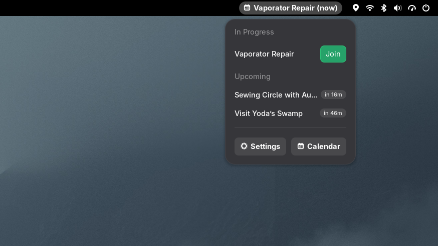
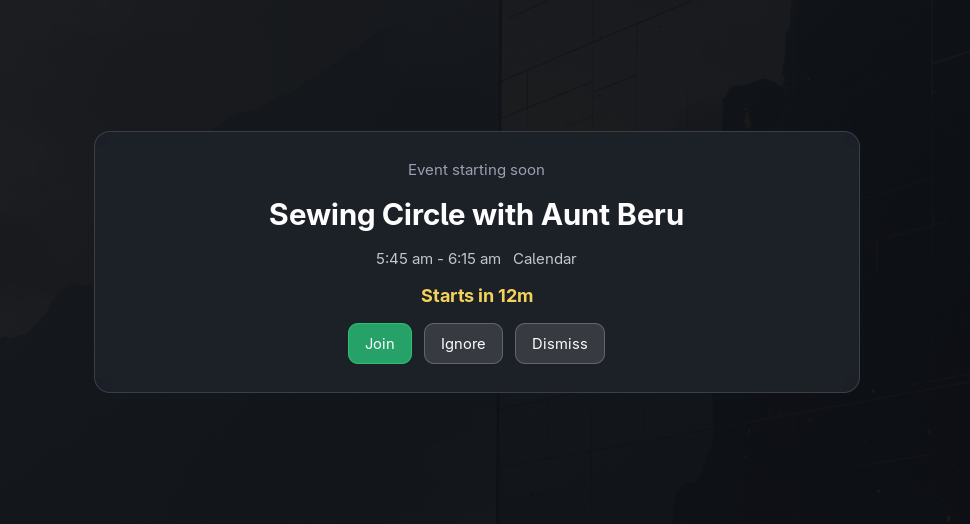

# MeetingTime

MeetingTime is a GNOME Shell extension that shows an unmissable, modal full-screen alert shortly before events start.

It provides a handy dropdown list of upcoming meetings, and can display alerts for any calendar you've configured in [Gnome Online Accounts](https://docs.rockylinux.org/10/desktop/gnome/onlineaccounts/).

## Screenshots

### Event list

Top panel indicator provides a quick list of upcoming meetings and events:

### Alerts

When events fall due, a full screen alert ensures you don't miss a meeting:

## Requirements

| Requirement | Version                |
| ----------- | ---------------------- |
| GNOME Shell | 45, 46, 47, 48, 49, 50 |
| GJS         | 1.76+                  |

## Getting Started

- [Download](https://github.com/danmoz/meetingtime/releases/latest/download/meetingtime@danmoz.shell-extension.zip) the latest version of `meetingtime@danmoz.shell-extension.zip` from [releases](https://github.com/danmoz/meetingtime/releases/latest).
- Install with `gnome-extensions install meetingtime@danmoz.shell-extension.zip`
- Enable with `gnome-extensions enable meetingtime@danmoz`

MeetingTime will automatically detect calendars you've set up in **Settings -> Online Accounts**.

To select which calendars to enable alerts for, click **Settings** in the indicator dropdown menu.

## Notes

- Event links are extracted from event URL/location/description fields and
  common providers are prioritized (Zoom, Meet, Teams, Webex, etc.).
- The Google Meet description parsing logic is adapted from GNOME Calendar's
  open-source implementation for compatibility with Google Calendar event
  bodies.
- A small JSON startup snapshot is stored under the user cache directory so the UI
  can show the previous event snapshot while the first live sync is still
  running.
- The extension listens for `PrepareForSleep` resume transitions and refreshes
  schedules after wake.

## Attribution

- Special thanks to the [GNOME Calendar](https://apps.gnome.org/Calendar/) project
  whose Google Meet description parsing logic was adapted for this extension.
